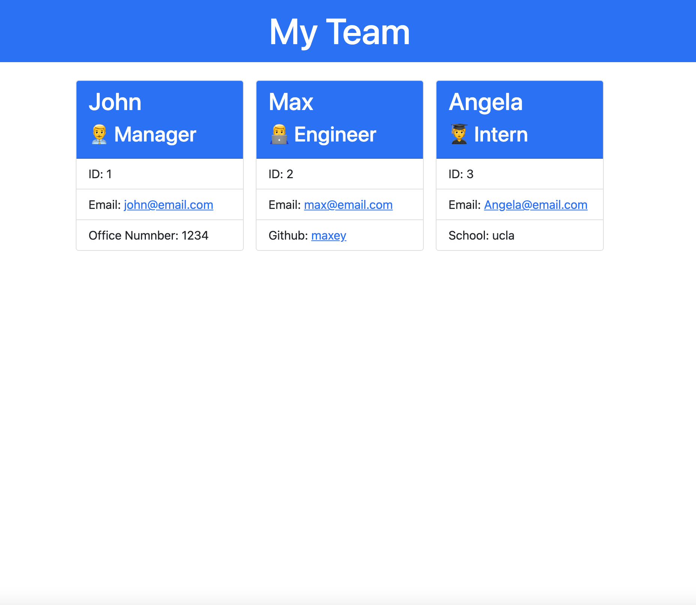

# Team Profile Generator
  
  ## Description
  This application is used to quickly create an HTML page that displays the pertinent information for a WebDev Team.  It allows the user to enter the Managers information(Name, ID, Email, and Office Number), Engineer's information(Name, ID, Email, and Github account), and Intern's information(Name, ID, Email, and School they attend).  When generated the page will have cards for each employee and links to their email as well a link the Engineer's Github account. 
  ## Table of Contents
  - [Installation](#installation)
  - [Usage](#usage)
  - [Questions](#questions)
  - [License](#license)
  - [Contribution](#contribution)
  - [Tests](#tests)
  ## Installation
  You will need to install NPM in order to run this program. It uses Inquirier and Jest.
  ## Usage
  Please see attached screenshot of html page as a reference:
  
  ## Questions
  https://github.com/ctolnai

  Please email me at christolnai@gmail.com for any questions.
  ## License
  This application is licensed under MIT
  ## Contribution
  N/A
  ## Tests
  Jest was used in order to test the classes and subclasses.